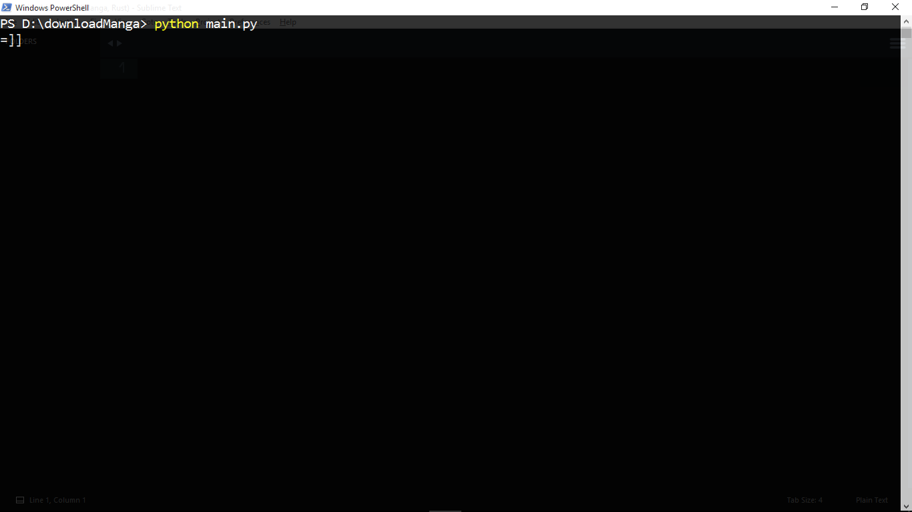

# Download Manga
Hỗ trợ download, tìm kiếm các bộ, tập truyện trên một số websites
## Hỗ trợ các websites
Dưới đây là một số webistes được hỗ trợ.
### Hỗ trợ download trên các websites
* [http://blogtruyen.com/](http://blogtruyen.com/)
* [http://truyentranhtuan.com/](http://truyentranhtuan.com/)
* [http://www.mangapanda.com/](http://www.mangapanda.com/)
* [http://hentaivn.net/](http://hentaivn.net/)
* [http://manganel.com/](http://manganel.com/)
* [http://truyentranh8.net/](http://truyentranh8.net/)
### Hỗ trợ tìm kiếm trên các websites
* [http://manganel.com/](http://manganel.com/)
* [http://truyentranh8.net/](http://truyentranh8.net/)
## Chuẩn bị cài đặt
Các bạn cần phải đáp ứng những thứ sau đây để có thể sử dụng được thư viện này.
### Cài đặt môi trường
Version Python 3.X (3.6.1).         
Các bạn [Download Python ở đây](https://www.python.org/downloads/) để cài đặt nếu như đang sử dụng hệ điều hành Windows.
### Các module cần cài đặt thêm
* [jsbeautifier](https://github.com/beautify-web/js-beautify)        

Cài đặt bằng command sau:
```
pip install jsbeautifier
```
* [BeautifulSoup](https://www.crummy.com/software/BeautifulSoup/bs4/download)           

Các bạn có thể down load về rồi chạy file `setup.py` bằng command sau:
```
python setup.py install
```
Nếu không, hãy cài đặt bằng cách sau:
```
pip install bs4
pip install lxml
```
* requests         

Cài đặt bằng command sau:
```
pip install requests
```
## Cách sử dụng
Chạy file `main.py`
```
python main.py
```
Config file `database\configthreading.txt` để thay đổi threading. Tăng giảm tốc độ download và số lượng thread cho phép tối đa là **10**
## Command line
Command line | Explaination
--- | ---
`load` | Download toàn bộ các tập truyện của một bộ truyện
`load only` | Download một tập truyện bất kì
`search` | Tìm kiếm truyện
`clear` | Xóa màn hình
`exit` | Thoát
## Ví dụ
Ta chạy file `main.py`.

Chọn bộ truyện mà ta muốn download.

Sử dụng command line `load` để bắt đầu download.

Kết quả.

Để download một chap cụ thể.

Dùng command `load only`.

Sử dụng `search` để tìm kiếm truyện.

File zip khi download về.

## Authors
- **Idea** by [chị Dồng](https://daynhauhoc.com/u/drgnz/summary)
- **Coded** by [Nguyễn Thành Trung](https://twitter.com/thanhtrung2314)